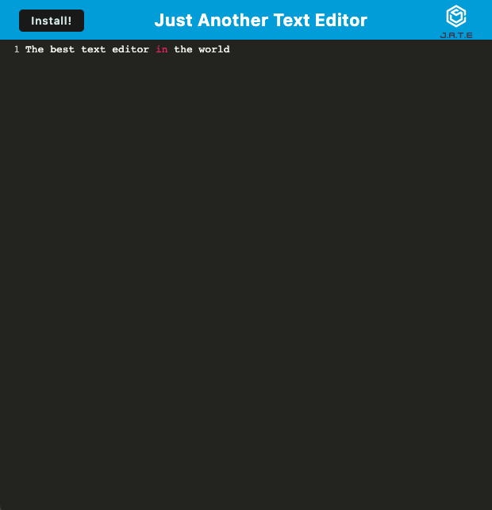

# Text Editor


## Description

This is a simple text editor, to be used in the browser. online or even offline. I built this to test my skills using webpack configs, routes, and servers. Also to make it easy for you to take notes, even with no internet.
## Installation

Install my-project with npm i

```bash
  npm i

```
    
## Usage/Examples

```javascript
  npm run start
```
Then open up your local host 3000, and have fun!


## Screenshots




## License

[MIT](https://choosealicense.com/licenses/mit/)

